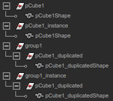

#Maya Python Script

##DAG Hirarchy
Directed Acyclic Graphs is a directed graph that contains no cycles.

In Maya, The DAG is composed of 2 types of DAG nodes
- transforms
    Maintain transformation and parenting information.
    Transform node can have multiple child nodes. 
- shapes
    Reference geometry. Do not provide parenting or transformation infomation
Any piece of geometry requires two DAG nodes above it, a shape node immediately above it, and a transform node above the shape node.

> DAG describes how an instance of an object is **constructed** from a piece of geometry

- MFnDagNode - has methods for determining the number of parents and thr parents of a node
- MFnTransform - is the function set for operating on transform node (derived from MFnDagNode) and has methods to get and set transformation.
- MFnMesh - is one of many types of function sets which operate on the many types of shape nodes. (derived from MFnDagNode, but not derived from MFnTransform)


##Instancing
Whenever a transform or shape node has multiple parent nodes, the node is considered to be instanced. Instancing can be useful to reduce the amount of geometry for a model.


The two valid DAG paths in this graph :
- Transform1 - Transform3 - Leaf
- Transform2 - Transform3 - Leaf

##DAG paths
    A path through the DAG is a set of nodes which uniquely identifies the location of the particular node or instance of a node in the graph. The path represents a graph ancestry beginning with the root node of the graph and containing, in succession, a particular child of the root node followed by particular child of this child
    
##Examples


    ```python
    import maya.api.OpenMaya as om

    def getDag(name):
        selectionList = om.MSelectionList()
        try:
            selectionList.add(name)
        except:
            return None
            
        dagPath = selectionList.getDagPath(0)
        return dagPath
        
    shape_dag, shape_node = getDag('pCube1Shape')
    tr_dag, tr_node = getDag('pCube1')
    it_dag, it_node = getDag('pCube1_instance')
    grp_dag, grp_node = getDag('group1')
    duptr_dag, duptr_node = getDag('pCube1_duplicated')
    dupshape_dag, dupshape_node = getDag('pCube1_duplicatedShape')

    dag = om.MFnDagNode(duptr_dag)
    print dag.parentCount()
    ```

    
